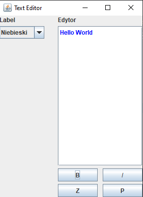
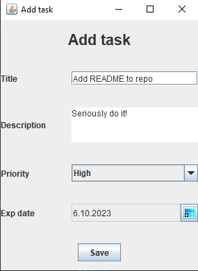

# JSL - JAVA Swing Lessons

## What is it all about?
In this repository I store solutions for exercises from my lessons. All projects are based on Java and it's library called Swing. If you are interested you are free to browse, download and modify all code in there.

## What can be found there?
**LAB01** \
There you can find how to make a temperature converter and basic game of guessing numbers from ranges(ex. from 1 to 100) in Swing.\
*Example 1*\
\
*Example 2*\

**LAB02** \
In here you can learn how to handle password verification.\
*Example 1* \

**LAB03** \
This laboratory was all about creating an app for storing your contacts in Swing and how to handle JLists, inserting data to JTextFields from stored objects and basic resource management.\
*Example 1* \

**LAB04** \
Over there you can find more about transfering data from one JList to another and how to make basic text editor.\
*Example 1* \
\
*Example 2* \

**LAB05** \
This project was to create Kanban like aplication. In other worlds how to make app for manging your task.\
*Example 1* \
 \
*Example 2* \
